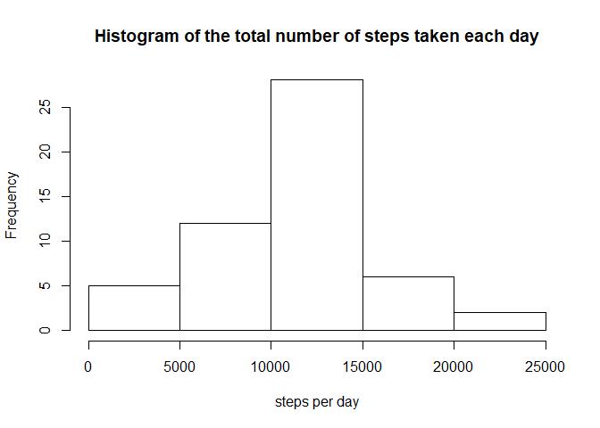
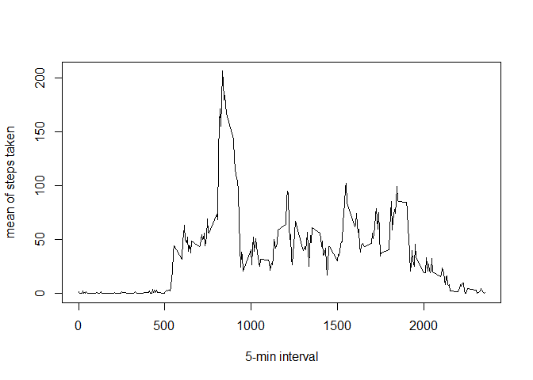
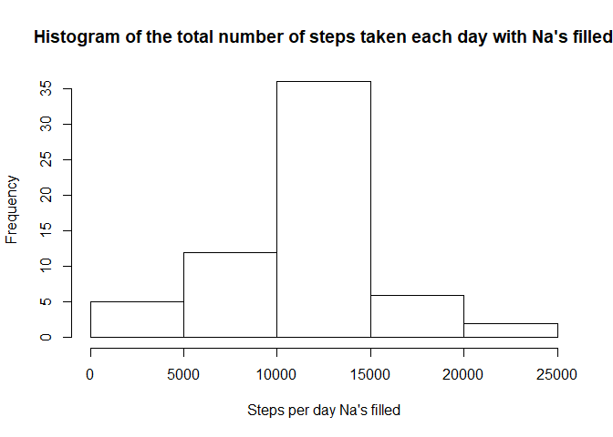
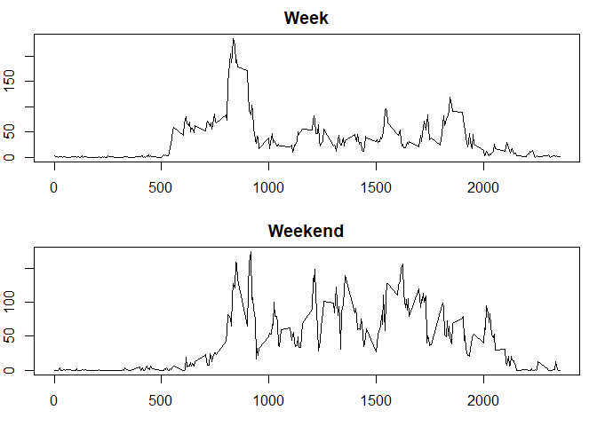

# Reproducible Research: Peer Assessment 1


Peer-graded Assignment: Course Project 1
======================
## Loading and preprocessing the data


#### Loading libraries


```r
library(dplyr)
```

```
## 
## Attaching package: 'dplyr'
```

```
## The following objects are masked from 'package:stats':
## 
##     filter, lag
```

```
## The following objects are masked from 'package:base':
## 
##     intersect, setdiff, setequal, union
```

```r
library(lubridate)
```

```
## 
## Attaching package: 'lubridate'
```

```
## The following object is masked from 'package:base':
## 
##     date
```

### Reading Dataset


```r
df1=read.csv("activity.csv")
```

### Histogram of the total number of steps taken each day


```r
df2=group_by(df1,date)
df_step_per_day=summarize(df2,sum_steps=sum(steps))
df_step_per_day=df_step_per_day[!is.na(df_step_per_day$sum_steps),]
hist(df_step_per_day$sum_steps, xlab="steps per day", main="Histogram of the total number of steps taken each day")
```

<!-- -->


## What is mean total number of steps taken per day?


### Mean and median number of steps taken each day


```r
mean_day=mean(df_step_per_day$sum_steps,na.rm=T)

median_day=median(df_step_per_day$sum_steps,na.rm=T)

print(paste("mean of the total number of steps taken per day:",as.character(mean_day)))
```

```
## [1] "mean of the total number of steps taken per day: 10766.1886792453"
```

```r
print(paste("Median of the total number of steps taken per day:",as.character(median_day)))
```

```
## [1] "Median of the total number of steps taken per day: 10765"
```

## What is the average daily activity pattern?


### Time series plot of the average number of steps taken


```r
df_interval=group_by(df1,interval)
df_step_per_interval=summarize(df_interval,mean_steps=mean(steps,na.rm = T))
plot(df_step_per_interval$interval,df_step_per_interval$mean_steps, type = "l",xlab= "5-min interval", ylab= "mean of steps taken" )
```

<!-- -->


### The 5-minute interval that, on average, contains the maximum number of steps


```r
max_interval=df_step_per_interval[df_step_per_interval$mean_steps==max(df_step_per_interval$mean_steps),]$interval

print (paste("Interval with the maximum number of step taken in average:",as.character(max_interval)))
```

```
## [1] "Interval with the maximum number of step taken in average: 835"
```

## Imputing missing values


### Imputing missing values

####  Calculate and report the total number of missing values in the dataset (i.e. the total number of rows with NAs)


```r
print (paste("Number of Na's:",as.character(sum(is.na(df1$steps)))))
```

```
## [1] "Number of Na's: 2304"
```


####  filling in all of the missing values in the dataset. 
#### Create a new dataset that is equal to the original dataset but with the missing data filled in.
The missing data(Na's) will be replaced with with mean of the interval


```r
df3=df1

#replacement of Na's with mean of the interval also
#new dataset with NA's filled
df3[is.na(df3$steps),]$steps=df_step_per_interval$mean_steps
```


####Make a histogram of the total number of steps taken each day and Calculate and report the mean and median total number of steps taken per day.


```r
df3_group=group_by(df3,date)


df3_step_per_day=summarize(df3_group,sum_steps=sum(steps))

hist(df3_step_per_day$sum_steps,xlab="Steps per day Na's filled",main="Histogram of the total number of steps taken each day with Na's filled")
```

<!-- -->

```r
mean_na_removed=mean(df3_step_per_day$sum_steps)
   
median_na_removed=median(df3_step_per_day$sum_steps)

print (paste("mean of the total number of steps taken per day:",as.character(mean_na_removed)))
```

```
## [1] "mean of the total number of steps taken per day: 10766.1886792453"
```

```r
print (paste("Median of the total number of steps taken per day:",as.character(median_na_removed)))
```

```
## [1] "Median of the total number of steps taken per day: 10766.1886792453"
```

```r
diff_mean=mean_na_removed - mean_day

diff_median = median_na_removed - median_day
```


#### Do these values differ from the estimates from the first part of the assignment? What is the impact of imputing missing data on the estimates of the total daily number of steps?

The difference between the mean of the dataset with Na's filled and the original is 0 and the difference between the median of the dataset with Na's filled and the original is 1.1886792

## Are there differences in activity patterns between weekdays and weekends?


#### Create a new factor variable in the dataset with two levels - "weekday" and "weekend" indicating whether a given date is a weekday or weekend day.


```r
df1$date=as.character(df1$date)

df1$date=ymd(df1$date)

df1$day_type=factor(is.element(wday(df1$date),c(1,7)),labels = c("weekday","weekend"))
```


#### Make a panel plot containing a time series plot (i.e. type = "l") of the 5-minute interval (x-axis) and the average number of steps taken, averaged across all weekday days or weekend days (y-axis).

```r
df_week=df1[df1$day_type=="weekday",]
df_week_grouped=group_by(df_week,interval)
df_week_mean=summarize(df_week_grouped,mean_steps=mean(steps,na.rm = T))
df_weekend=df1[df1$day_type=="weekend",]
df_weekend_grouped=group_by(df_weekend,interval)
df_weekend_mean=summarize(df_weekend_grouped,mean_steps=mean(steps,na.rm = T))
par(mar=c(3,2,2,1))
par(mfrow=c(2,1))
plot(df_week_mean$interval,df_week_mean$mean_steps,type = "l",main="Week")
plot(df_weekend_mean$interval,df_weekend_mean$mean_steps,type = "l",main="Weekend")
```

<!-- -->

